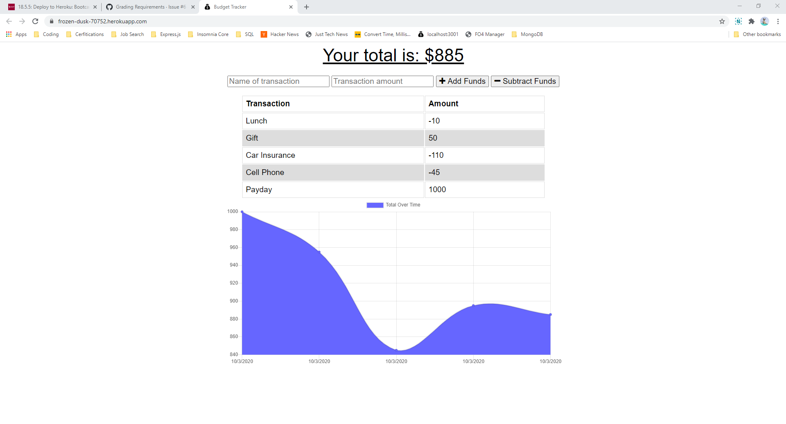

  # Budget-pwa

  

  ## Screenshot
  

  ## Description
  This project is an example of converting an existing app into a progressive web app. It uses IndexedDB and a service worker to provide the user with a seamless offline experience and a web manifest to allow the user to install the application to their device.

  ## Links
  [Heroku](https://frozen-dusk-70752.herokuapp.com/)

  ## Table of Contents
  * [Description](#description)
  * [Links](#links)
  * [Installation](#installation)
  * [Usage](#usage)
  * [License](#license)
  * [Contribution](#contribute)
  * [Questions](#questions)

  ## Installation
  The app is live deployed to Heroku using Mongo Atlas for the back end. To run it locally, first clone the repo. It uses Node, Express, MongoDB, so you will need to install your dependencies before it will work locally. Once that is done, launch server.js. The site will be running locally on localhost:3001.

  ## Usage
  The PWA functionality will work automatically, the service worker and IndexedDB are set up automatically when you access the site through a browser. You can install the application by clicking on the "+" symbol in the address bar. To use the budgeting app itself, enter a transaction name and an amount, then either click the button to add or subtract the entered amount from your total. The transaction history will be recorded and the graph will reflect your deposits and withdrawls.

  ## License
  This software is licensed under the [MIT license](https://choosealicense.com/licenses/mit/).

  ## Contribution
  This project follows the guidelines of the [Contributor Covenant](https://www.contributor-covenant.org/version/2/0/code_of_conduct/). If you are interested in contributing, please contact me at my email in the Questions section of this README.

  ## Questions
  If you have any questions about this project, you can email me at joe.lawton@outlook.com.
  For other projects, check out my [GitHub](https://github.com/jdlawton).
